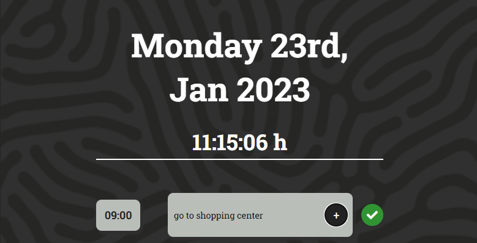

# Day Task Traker

## Description
The Day Task Tracker is an application that allows users to keep track of their tasks for the day. The application allows users to add tasks that are saved to local storage and provides a simple, easy-to-use interface. A "done" button will appear when a task is saved, which when clicked, will remove the task from local storage.

https://nowinoa.github.io/Day-Tasker/

## Table of Contents
- Installation
- Usage
- Credits
- License

## Installation
1. Download the code from this repository.
2. Open the index (index.html) file in your browser to run the application.

## Usage
The application is simple and easy to use. You can add tasks by typing in the text field and then clicking the "+" button. The task will be saved to local storage and a "done" button will appear next to the task. You can remove a task by clicking the "done" button.

## Credits
This project was built using jQuery and moment.js library. Project Author: Ainhoa Prada.

## License
This project is licensed under the MIT License.

